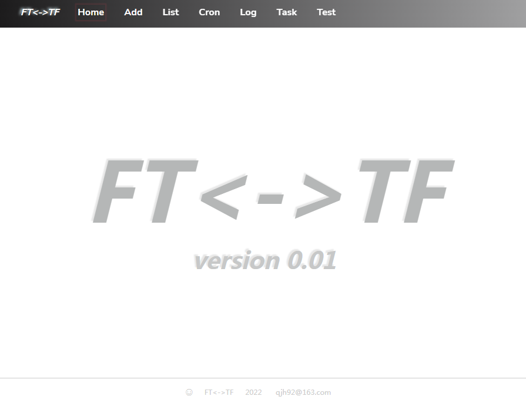
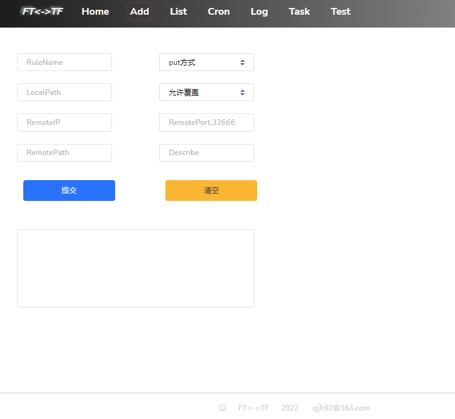
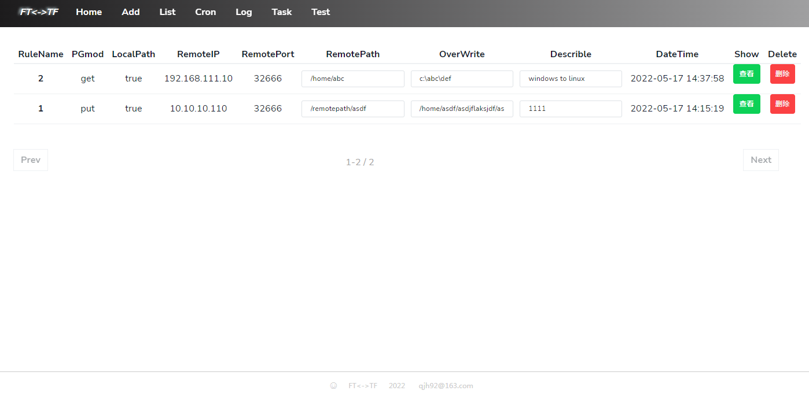
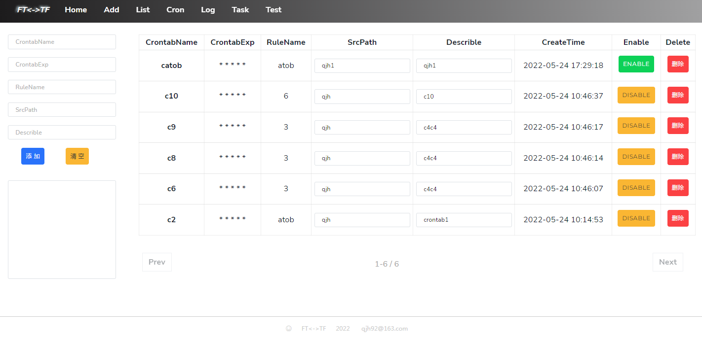
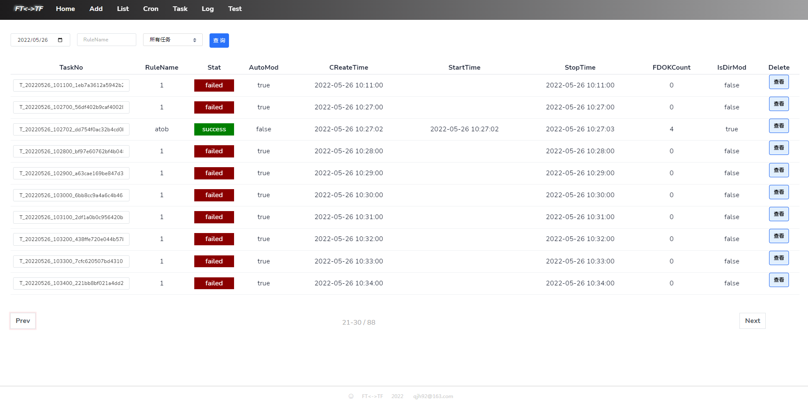
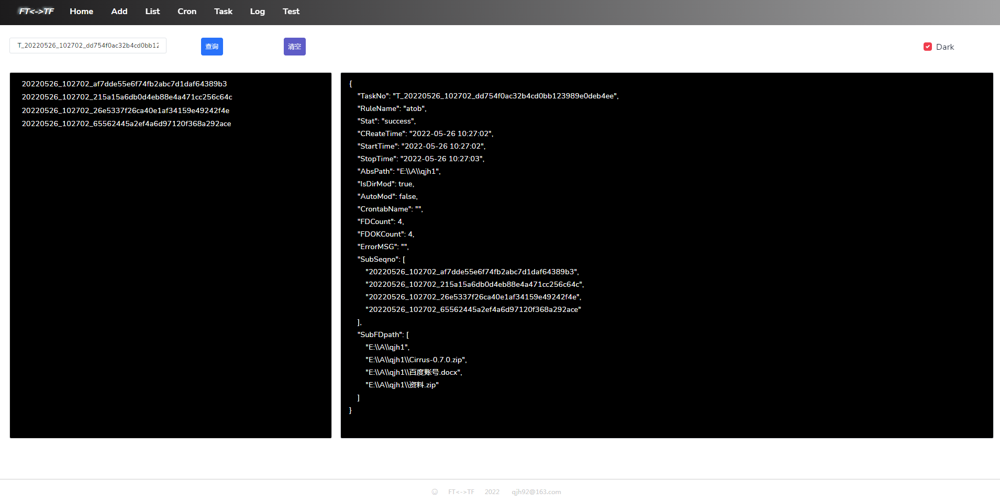
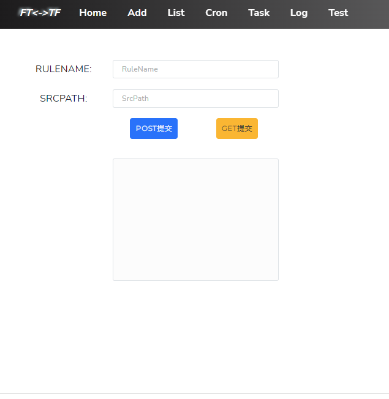

# FTTF

FTTF = File Transport Transport File

FTTF 是一个基于 Go 语言开发的文件传输系统，用于系统间传输文件和文件夹，支持window、linux之间的文件传输，支持配置自动任务定时传输。

> 这是我在学习Go语言过程中的一个练习项目，最开始只是实现了简单的http及socket通讯，后来在通讯模块的基础上完成了文件传输功能，同时也提供了简单的http管理模块。

## 编译

```shell
cd src/
mkdir ../bin
go build -o ../bin/fttf
chmod +x ../bin/fttf
```


## 功能特性

FTTF本身包括服务端和客户端两部分，支持两种运行方式，一种是作为服务端提供文件传输及配置管理功能，一种是作为客户端向服务端发送文件传输申请。

#### 服务端模式

作为服务端时，默认会启动两个端口，管理端口hport(32555)和传输端口sport(32666)

```shell
#直接启动,采用默认端口32555和32666
fttf
#用管理端口a，传输端口b启动
fttf -hport a -sport b
```

采用默认方式启动

```shell
[fttf@bogon bin]$ ./fttf 
INFO  2022/05/26 14:05:45.338951 main.go:77 

    ____________   __    __       ____________
   / ____/_  __/  / /    \ \     /_  __/ ____/
  / /_    / /    / / _____\ \     / / / /_    
 / __/   / /     \ \/_____/ /    / / / __/    
/_/     /_/       \_\    /_/    /_/ /_/

INFO  2022/05/26 14:05:45.339185 main.go:78 sport=32666,hport=32555
INFO  2022/05/26 14:05:45.340642 config.go:86 map[]
INFO  2022/05/26 14:05:45.342895 httpserver.go:59 启动httpserver......hport=32555
INFO  2022/05/26 14:05:45.343126 socketserver.go:25 启动socketserver......sport=32666

```

```shell
#服务端启动后，目录信息
[fttf@bogon bin]$ ls -lrt
总用量 9960
-rwxr-xr-x 1 fttf fttf 10195550 5月  26 14:03 fttf       #可执行程序
drwxrwxr-x 5 fttf fttf       67 5月  26 14:05 logs       #日志
drwxrwxr-x 2 fttf fttf        6 5月  26 14:05 configs    #规则配置
drwxrwxr-x 2 fttf fttf        6 5月  26 14:05 tasks      #任务信息
drwxrwxr-x 2 fttf fttf        6 5月  26 14:05 crontabs   #定时任务配置
[fttf@bogon bin]$ 

```


启动服务后，可用通过访问 http://ip:hport进入管理控制台，采用默认方式启动时，访问地址 http://localhost:32555



##### Add

用于添加传输规则，只有添加传输规则以后，才能够按预定规则执行文件传输任务



>RuleName：传输规则名称，唯一不重复
>
>put方式：将本地的文件放到远程服务器上
>
>get方式：将远程服务器上的文件取到本地来
>
>LocalPath：本地对应的目录，如果是put方式，本地对应的是欲发送的文件目录；如果是get方式，对应的是本地欲接收存放的目录
>
>RemotePath：远程目录，如果是put方式，对应的是要存放到远程主机上的目录；如果是get方式，对应的是远程主机上要取回来的目录
>
>RemoteIP：远程主机运行fttf的地址
>
>RemotePort：远程主机运行fttf的传输端口，默认32666
>
>允许覆盖：可以设置文件存在时，是否覆盖旧文件
>
>Describe：规则描述信息

##### List

列出系统中已经配置的所有传输规则



##### Cron

可以在cron中配置自动任务，定时启动传输；在添加完成后，默认是disable状态，需要手工更改为Enable状态，才能生效



##### Task

可以查看Task的执行详情。系统中的每次传输对应一个Task，每个Task有一个唯一的TaskNO



##### Log

在Task中会传输多个文件和文件夹，每一个文件和文件夹的传输都会有一个日志进行记录，在log中可以通过taskno查询到所有的传输日志。



##### Test

提供了一个简单的测试入口，输入配置的规则和路径，发起文件传输请求




#### 客户端模式

​	客户端模式时，采用http协议发起get请求，调用本地服务端进行文件传输；发起http请求可以使用fttf，也可以使用curl；

​    请求本地默认fttf服务的url是http://localhost:32555/go?RuleName=xx&SrcPath=xxx

##### fttf请求

fttf作为客户端时，主要用于向本机的fttf管理端发送传输请求，超时时间30秒

```shell
#往本机localhost:32555发送申请
fttf -config atob -path /home/a
#如果需要指定管理端的ip和端口，命令如下
fttf -config atob -path /home/a -ip x.x.x.x -port xxxx
```

>config：指定要使用的规则名称
>
>path：指定源文件路径
>
>ip：指定要连接的管理端地址
>
>port：指定要连接的管理端端口，默认32555
>
>当shell命令返回后，如果执行成功，返回结果码为0，失败为1

##### curl请求

除了使用fttf来发送传输请求，还可以使用linux上的curl命令来发起传输请求，返回对应的json应答。返回的json报文中，RspCode等于0时，代表成功；

```shell
#向本地fttf发送传输请求，采用规则WtoL，路径是qjh1
#返回的RspCode=1，请求失败，失败原因在RspMsg中，显示连接对方超时
[fttf@bogon bin]$ curl 'http://localhost:32555/go?RuleName=WtoL&SrcPath=qjh1'
{"RspCode":1,"RspMsg":"taskno=T_20220526_144416_a023a5fae01045fdaabae5683bdaf860,error=dial tcp 192.168.137.1:32666: i/o timeout","RspExtMsg":null,"PageUp":false,"PageDown":false,"TotalCount":0,"StartIndex":0,"EndIndex":0}
[fttf@bogon bin]$ 
```

```shell
#返回的RspCode=0，请求成功
[fttf@bogon bin]$ curl 'http://localhost:32555/go?RuleName=WtoL&SrcPath=qjh1'
{"RspCode":0,"RspMsg":"ok! taskno=T_20220526_144714_807c7334f88f4855b2948d11d73acb3b","RspExtMsg":null,"PageUp":false,"PageDown":false,"TotalCount":0,"StartIndex":0,"EndIndex":0}
[fttf@bogon bin]$ 
```


